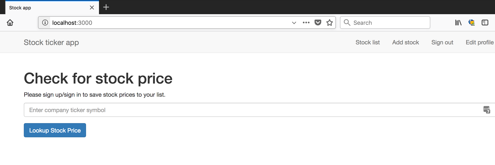
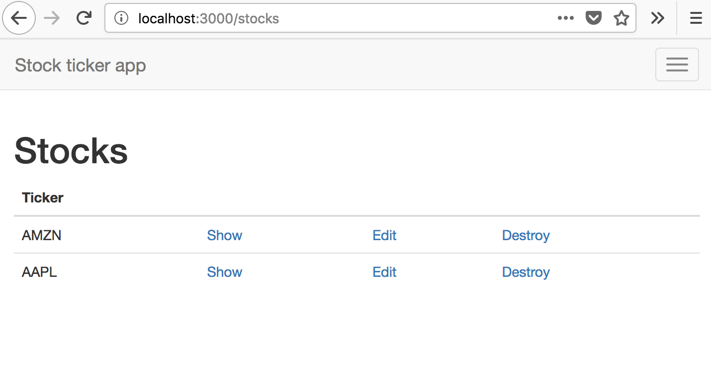
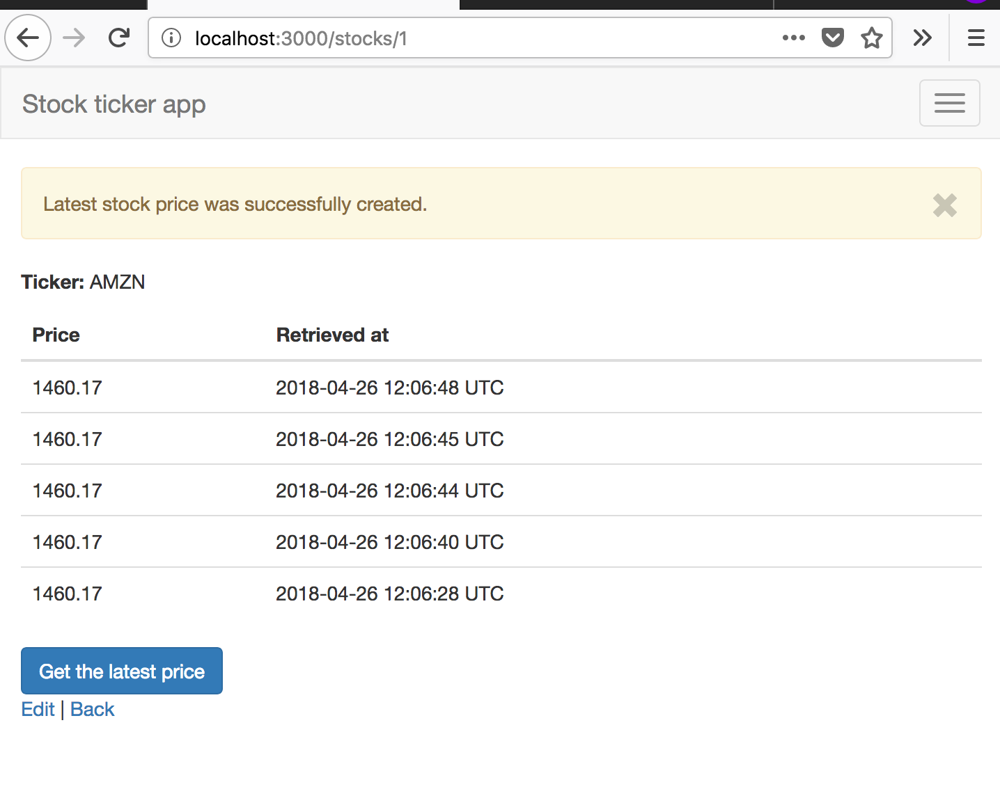
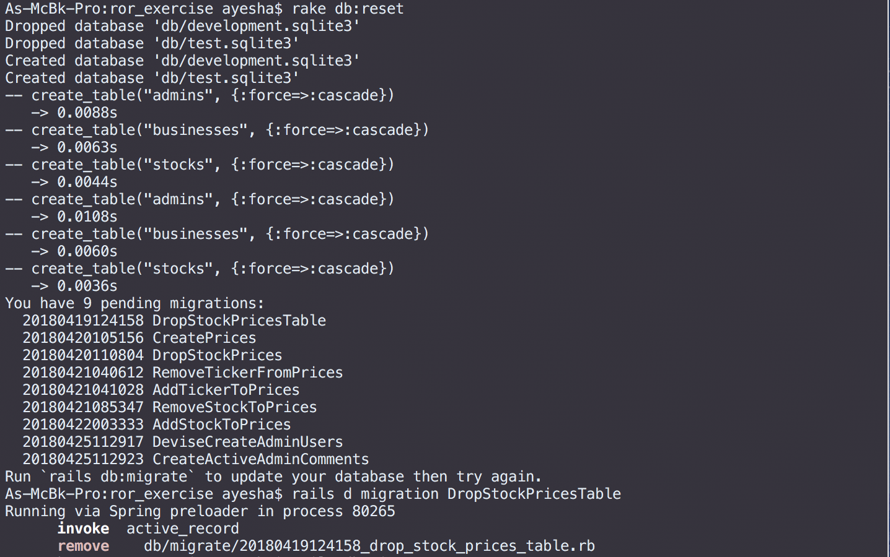
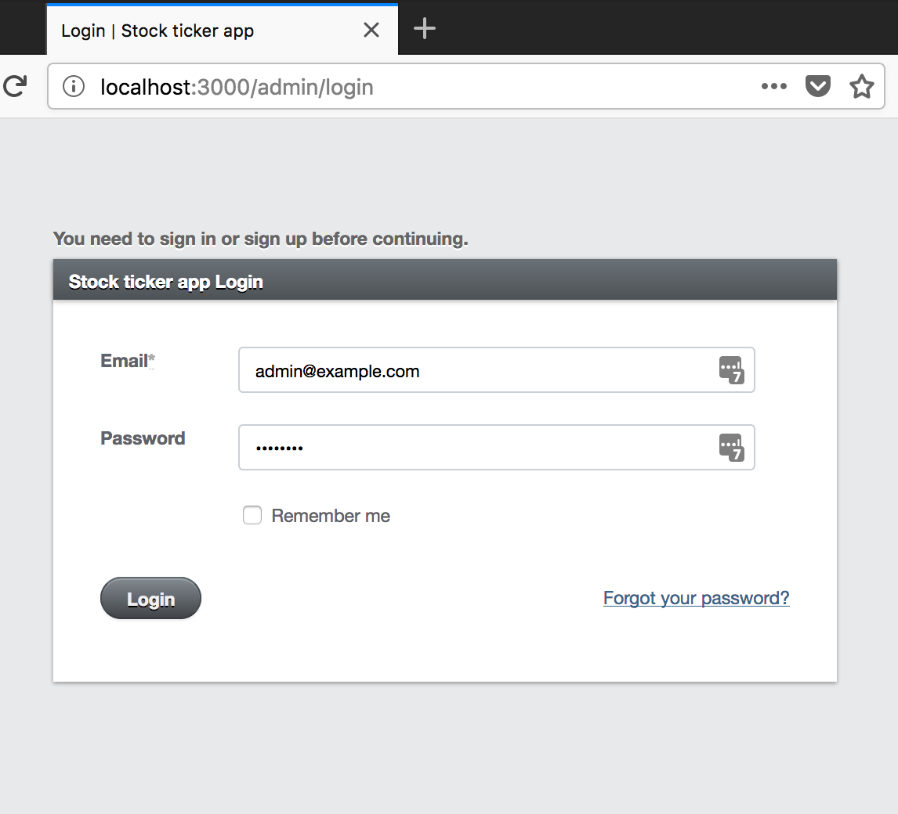
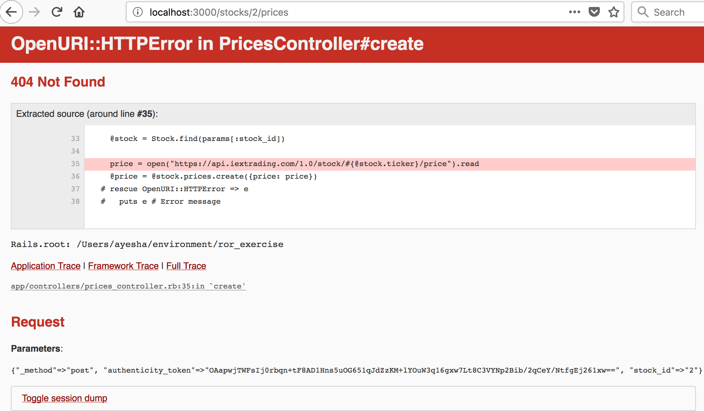
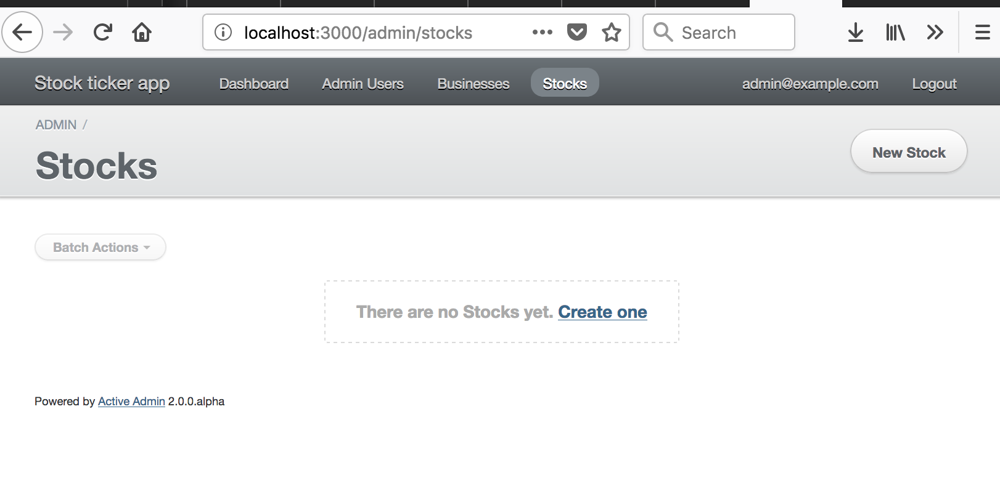
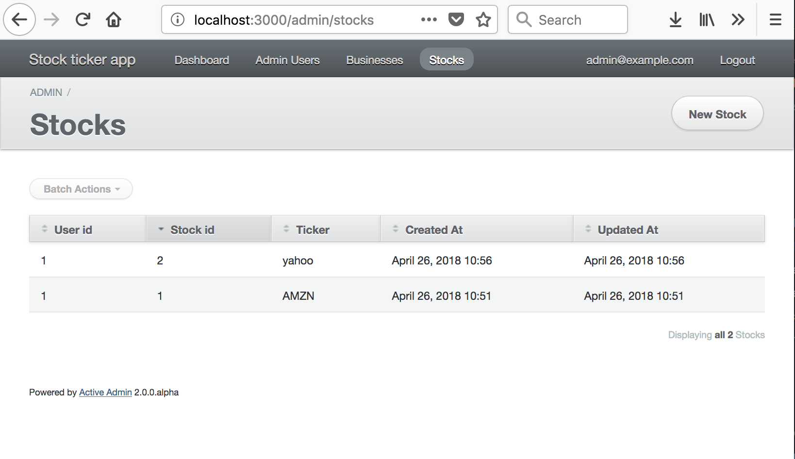

# README

ruby -v: `ruby 2.3.1`
rails -v: `Rails 5.1.6`

**Main page**

**Stocks list**

**Prices list**

**Clone directory**
`git clone https://github.com/wnsy/ror_exercise.git`

**Install all dependencies**
`bundle install`

**Create db and migrate schema**
`rake db:create`
`rake db:migrate`

In case there's an error saying that `stock_prices` table doesn't exist, please do the following:

`rake db:migrate:down VERSION=20180425112923` (the latest migration file version)

**Run app**
`rails s`

If there's an error to start the server:
`bin/rails db:migrate:down VERSION=20180425112923 RAILS_ENV=development`

or this if it's complaining about a  migration file
`rails d migration MIGRATIONFILE`
e.g.
`rails d migration DropStockPricesTable`

After deleting the file(s), run this again:
`rake db:migrate`

**Admin and store1/store2 login**
In order to be able to log in to `http://localhost:3000/admin/login`

Please run the `/db/seeds.rb` file
`rake db:seed`

Then on the admin login page:

`Email admin@example.com`
`Password: password`

To find info on the login for store1 and store2 for business users:
`/db/seeds.rb`

##Known issues
**Bug 1:** Fetching a non-existing ticker will cause an exception, it will direct you to this page:

I've tried handling the exception based on [this reference](https://stackoverflow.com/questions/13020597/getting-the-contents-of-a-404-error-page-response-ruby?rq=1), but doing that resulted in a user to still save a price (empty) and getting the stock price for an existing ticker didn't work too.

**ActiveAdmin dashboard page: `Create Stock`**
**Without the list:**

**With the list:**

I tried to find a way to get rid of the `New Stock` / `Create one` but at the moment it's still there. You can't create one (will throw an error/go to an exception error page) as only business users can do that and you should only be able to View the list once the users have created their stock lists.
(Reflection: My plan to have a separate Content Management System/CMS-like for admin users backfired. Cons for using a library, apart from having to deal with many dependencies. Lesson learned).

**Testing**
I ran into issues with setting up testing, so had to skip this part (although some codes are in the test models folder).
